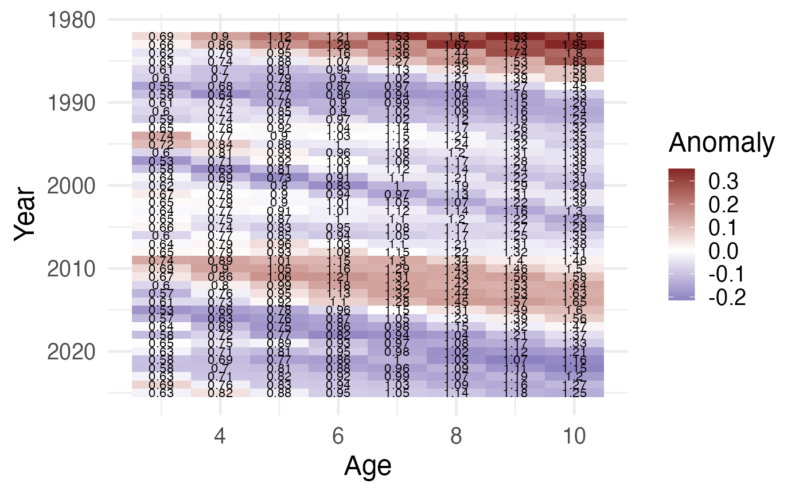
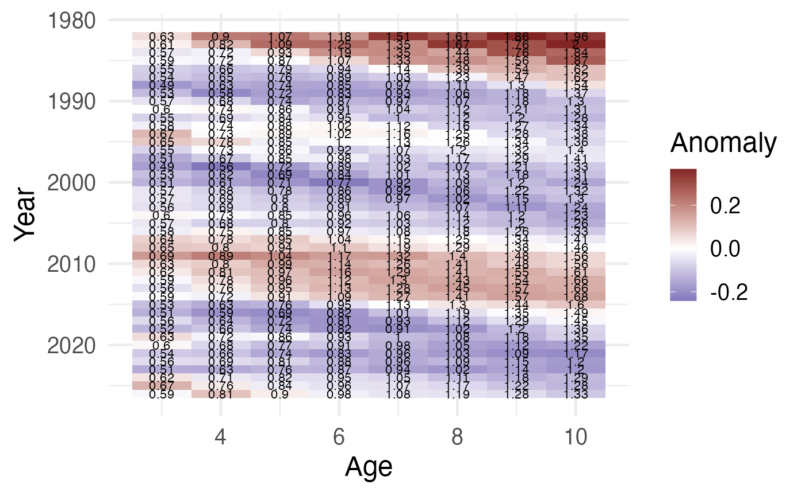
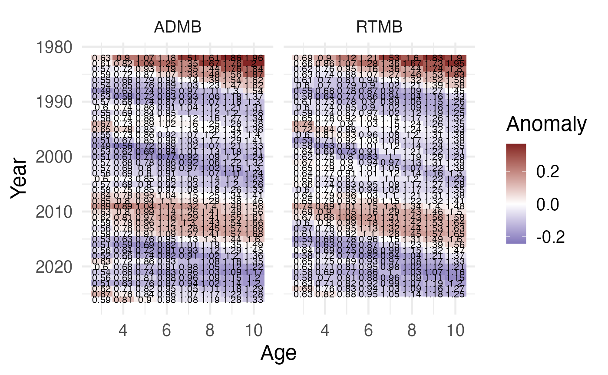

# WtAgeRe ebspollock example

## Example: EBS pollock

This vignette shows an RTMB workflow (no ADMB toolchain required) using
the `examples/ebspollock` dataset, and an optional ADMB comparison when
a `.rep` file is already available.

``` r

library(WtAgeRe)

example_dir <- here::here("examples", "ebspollock")
base <- file.path(example_dir, "wt")
has_rtmb_api <- "fit_wt_rtmb" %in% getNamespaceExports("WtAgeRe")

# RTMB fit from wt.dat
if (has_rtmb_api && requireNamespace("RTMB", quietly = TRUE) && file.exists(paste0(base, ".dat"))) {
  fit_rtmb <- fit_wt_rtmb(
    datfile = paste0(base, ".dat"),
    control = list(iter.max = 200, eval.max = 400)
  )
  pred_rtmb <- fn_get_pred(fit = fit_rtmb, source = "RTMB")
  fn_plot_anoms(pred_rtmb)
}
```



``` r


# Optional ADMB comparison (requires an existing wt.rep)
if (file.exists(paste0(base, ".rep"))) {
  pred_admb <- fn_get_pred(file = base, source = "ADMB")
  fn_plot_anoms(pred_admb)
}
```



``` r


if (exists("pred_rtmb") && exists("pred_admb")) {
  pred_both <- rbind(pred_admb, pred_rtmb)
  fn_plot_anoms(pred_both)
}
```


